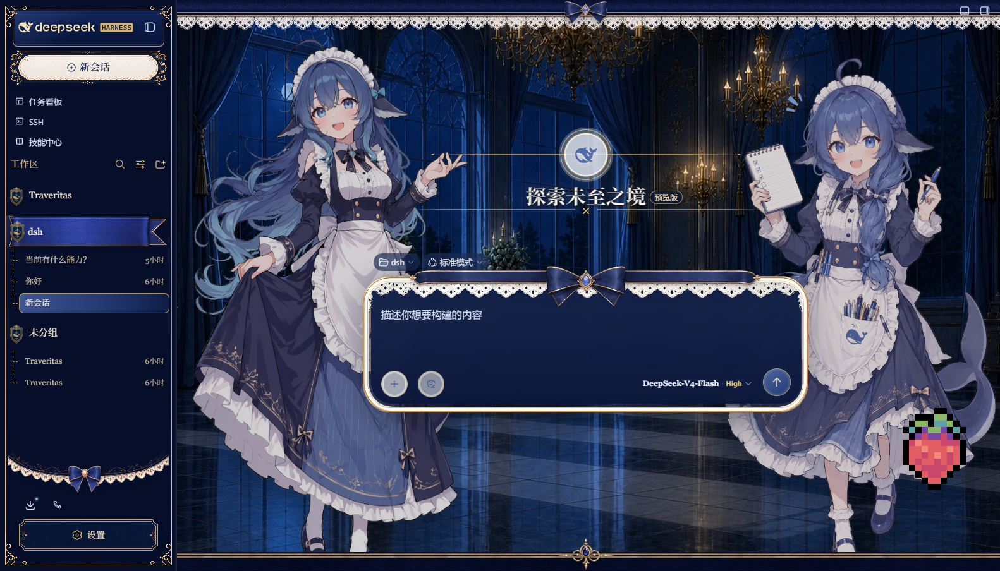
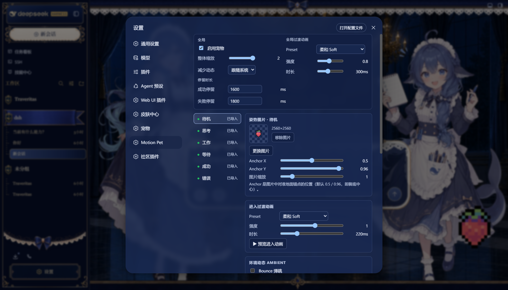

# dsh-motion-pet

DeepSeek Harness（DSH）Web UI 的宠物插件 —— **Animation Middleware for Agent Pets**。

你只需要准备少量静态角色图（如 `idle.webp` / `thinking.webp` / `happy.webp`），插件的程序化 Motion Engine 会自动生成漫画感的状态切换动画（squash & stretch）与环境动态（Bounce / Sway / Breathing），并跟随 Agent 的真实运行状态自动切换姿势。



## 特性

- **少量图片即可工作**：至少一张图；六个状态槽位（待机/思考/工作/等待/成功/错误）各自可配，缺失状态自动 fallback
- **漫画式过渡动画**：Comic Pop / Soft / Jelly / Jump / Snap / Celebrate / Deflate，强度与时长可调
- **状态环境动态**：六个状态可分别组合 Bounce（随机间隔）、Sway、Breathing，并挂载一个自定义环境动画
- **Anchor 真实对齐**：换图时脚底不瞬移，squash/stretch 围绕地面锚点
- **跟随 Agent 状态**：思考摇摆弹跳、等待用户时安静等待、完成时庆祝、出错时泄气——基于宿主事件归一化 + 状态稳定器，流式输出不会导致宠物乱跳
- **可拖动、可缩放、位置持久化**；尊重 `prefers-reduced-motion`
- **多宠物预设**：每只宠物独立保存姿势图片、状态动画与整体缩放，可快速切换、复制、重命名和删除
- **Timeline Engine**：所有动画（内置与自定义）都是 `AnimationDefinition` 数据，经同一个 Timeline Compiler / Scheduler 执行（WAAPI），无专用分支——自定义动画格式见 [docs/motion-format.md](docs/motion-format.md)
- **可视化时间轴编辑器**：管理自定义过渡/环境/互动动画，编辑轨道、关键帧、easing 与事件并循环试播

## 截图

| 设置编辑器 | 宠物特写 |
| --- | --- |
|  |  |

## 安装

要求：已安装 DSH（`@deepseek-ai/dsh`，在 0.1.0-rc.7 上实测）。

```bash
# 从 npm 安装（发布后）
dsh plugin --profile web add dsh-motion-pet

# 或从本地目录安装（开发）
dsh plugin --profile web add link:/path/to/dsh-motion-pet
```

重启 `dsh web` 生效。

## 升级与卸载

```bash
dsh plugin --profile web update dsh-motion-pet     # 升级
dsh plugin --profile web remove dsh-motion-pet     # 卸载
```

卸载只移除插件本身；你的配置与图片保留在 `$DSH_HOME/motion-pet/`（默认为 `~/.dsh/motion-pet/`），需要彻底删除时手动移除该目录即可。

## 使用

打开 DSH Web UI → 设置 → **Motion Pet** 卡片：可快速启用/停用宠物、调整整体缩放，并查看图片导入进度。点击卡片上的「**打开完整编辑器 →**」（或浏览器直接访问 `/motion-pet-editor/`）会在新标签页打开独立编辑器页面：

1. **管理宠物**：顶部「宠物」区可把当前配置保存为副本，或新建空白宠物；切换后，下面所有面板都编辑当前宠物。姿势、状态动画与整体缩放会自动镜像进当前预设。
2. **导入图片**：在左侧选择状态（如「待机」），点击「更换图片」。支持 PNG / WebP / JPEG（JPEG 无透明背景，会提示）。推荐透明背景、近似正方形画布、角色完整的图片；不同姿势尽量保持角色视觉尺寸一致。
3. **调 Anchor**：Anchor X/Y 标记角色的「脚底中心」（默认 0.5 / 0.96）。多张图的 Anchor 对齐后，切换姿势时角色不会瞬移。可用「图片缩放」微调大小。
4. **调动画**：每个状态可选进入过渡（Preset / 强度 / 时长）与环境动态（自定义环境动画 + Bounce / Sway / Breathing）；「全局」区设置默认过渡、整体缩放（0.3~4.0）、减少动态（跟随系统 / 总是 / 从不）、成功/失败停留时长。底部动画库可创建和编辑自定义时间轴动画。
5. **实时预览**：右侧预览区点击状态按钮即可模拟状态切换（走与正式 Overlay 相同的渲染与状态机），改动会即时进入预览；点击“保存修改”后写入当前宠物预设，主界面的宠物会在数秒内跟进。

也可以直接访问 `http://127.0.0.1:3080/motion-pet-editor/`（端口以你的 DSH web 配置为准）。

想快速试手感而不碰真实配置：构建后直接双击 `preview/index.html` 打开独立预览页（无需 DSH），还支持贴入自定义 `AnimationDefinition` JSON 即注册即播。

## 状态说明

| 视觉状态 | 触发 | 默认表现 |
| --- | --- | --- |
| 待机 idle | Agent 空闲 | 缓慢摇摆 + 呼吸 |
| 活跃 active | 生成中 / 跑工具（thinking/coding/command/working 统一为活跃，**不频繁换图**） | 思考：摇摆 + 随机弹跳；工作：紧凑 bounce + 呼吸 |
| 等待 waiting | 等你批准权限 / 回答问题 | 更慢的摇摆 + 弱呼吸 |
| 成功 success | 一轮任务完成 | Celebrate 进入动画，短暂停留（默认 1600ms）后回待机 |
| 错误 error | 出错 / 中断 | Deflate 进入动画，停留（默认 1800ms）后回待机 |

点击宠物会轻轻弹一下（不改变状态）。拖动宠物会记住位置；窗口缩小时宠物会被拉回视口内。

## 兼容版本

- DSH：`0.1.0-rc.7`（本仓库开发/验收版本；插件 API 若变化以 `docs/implementation-notes.md` 记录为准）
- 运行环境：DSH Web UI（Chromium 系浏览器）
- 构建：Node ≥ 20、pnpm

## 开发

```bash
pnpm install
pnpm run build       # tsc -b && tsdown → lib/index.js（host）、lib/client.js、lib/editor.js（独立编辑器页）、preview/preview.js
pnpm vitest run      # 测试（tests/，649 用例）
pnpm run typecheck   # 双工程类型检查
```

改代码后重新 `pnpm run build`，重启 `dsh web` 生效（纯 client 改动刷新页面即可）。

## Known limitations

- Motion Pack 导入导出、更多内置 ambient channel 与 Transition Matrix override 尚未实现
- Agent 状态联动的「无焦点会话」聚合回退模式按优先级取最紧急会话（WAITING > ERROR > ACTIVE > SUCCESS > IDLE，终态带 TTL）；正常跟随当前会话
- 不执行/不信任用户资产：SVG 明确拒绝，图片只做解码展示
- 多浏览器标签同时编辑同一配置为 last-write-wins（revision/CAS 属后续项）

## License

MIT
